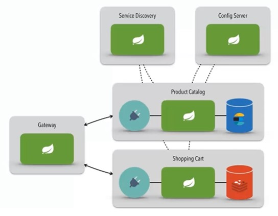

# Product-catalog / Shopping-cart Microservice
A microservice architecture example project.

Development for didactic purposes, not representing a suitable format for production environments.

The Project that is part of Santander Bootcamp Fullstack Developer, promoted by [Santander](https://app.becas-santander.com/) and [Digital Innovation One](https://web.digitalinnovation.one/). Classes presented by [Oswaldo Neto](https://github.com/oswaldoneto).

### Architecture layers
- Config-server
- Service-discovery (Eureka)
- Gateway API
- Microservices: Product-catalog and Shopping-cart



### Configuration repository
[Configuration repository for "config-server"](https://github.com/clementesc/dio-santander-springcloud-config)

### Run order
Services should, by choice, be started (bootRun) in this order:
```
1. config-server
2. service-discovery
3. gateway
4. product-catalog
5. shopping-cart
```
### Some local environment URL for check 

[Config-server actuator status](http://localhost:8888/actuator/health)

[Service-discovery actuator status](http://localhost:9000/actuator/health)

[Gateway actuator status](http://localhost:8080/actuator/health)

[Eureka System status](http://localhost:9000)


### Data load over gateway (load balanced)
POST on http://localhost:8080/product

Body:
```json
{
    "id":"1",
    "name": "TV",
    "amount": "10"
}
```

POST on http://localhost:8080/cart/123

Body:
```json
{
    "productId": 1,
    "amount": 10
}
```

### Data get over gateway (load balanced)
GET on http://localhost:8080/product/1

GET on http://localhost:8080/cart/123

### Elasticsearch index info
GET on http://localhost:9200/product

GET on http://localhost:9200/cart

### Microservice config check
GET on http://localhost:8888/product-catalog/default

GET on http://localhost:8888/shopping-cart/default